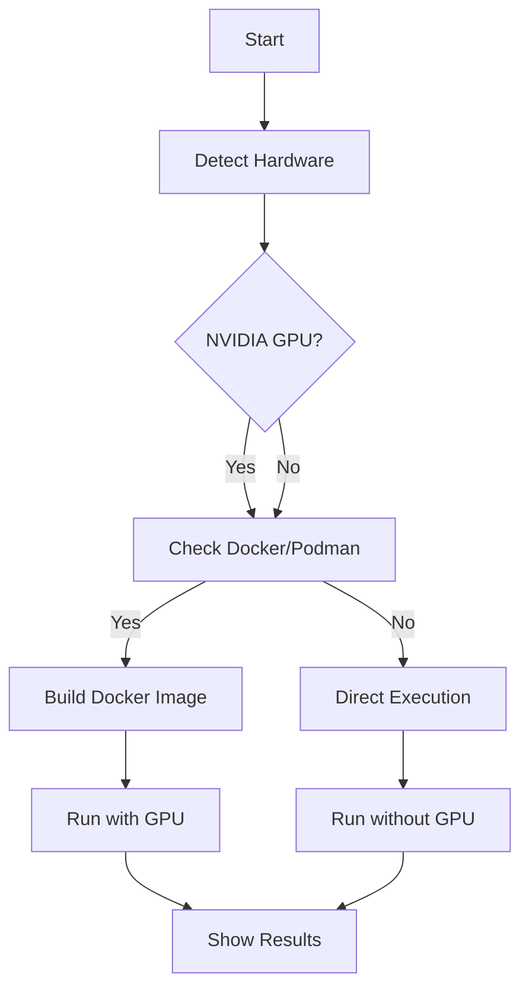

# Ultimate FFT Rivalry Leaderboard Script Guide

## 🎯 The One Script to Rule Them All

This guide explains the `ultimate_fft_leaderboard.sh` script - the most comprehensive solution for running the FFT rivalry leaderboard with automatic hardware detection and optimal execution strategy.

## 🚀 What This Script Does

1. **Detects your hardware** (NVIDIA GPU, Docker/Podman, Rust)
2. **Chooses the best execution strategy** automatically
3. **Handles all setup** (installs missing dependencies)
4. **Runs the leaderboard** with optimal configuration
5. **Provides clear output** with color-coded status

## 📋 Execution Strategies

The script automatically selects one of three strategies:

### 1. Docker/Podman with NVIDIA GPU (Best Performance) ⭐
- **When**: NVIDIA GPU + Docker/Podman available
- **Features**: cuFFT benchmarks, GPU acceleration
- **Performance**: 2-5× faster than WebGPU

### 2. Docker/Podman without GPU (Good Performance)
- **When**: Docker/Podman available, no NVIDIA GPU
- **Features**: WebGPU implementations only
- **Performance**: Full WebGPU acceleration

### 3. Direct Execution (Works Everywhere)
- **When**: No Docker/Podman available
- **Features**: WebGPU implementations
- **Performance**: Full functionality, no container overhead

## 🎬 How It Works



## 📝 Usage

### Basic Usage
```bash
chmod +x scripts/ultimate_fft_leaderboard.sh
./scripts/ultimate_fft_leaderboard.sh
```

### What to Expect
```
🚀 Ultimate FFT Rivalry Leaderboard with cuFFT Support
====================================================

=== Hardware Detection ===
✅ NVIDIA GPU detected: NVIDIA GeForce RTX 3090
✅ Docker detected: Docker version 20.10.7
✅ Rust/Cargo installed: cargo 1.58.0

=== Execution Strategy ===
🎯 Strategy: Docker/Podman with NVIDIA GPU (Best Performance)

=== Executing FFT Rivalry Leaderboard ===
📦 Building Docker image (this may take a while)...
✅ Using existing Docker image
🎯 Starting FFT rivalry leaderboard with cuFFT...

=== FFT Rivalry Leaderboard ===
--- N = 256 ---
                  Implementation |    Batch |     MSamples/s |     GFLOPS |   Status
------------------------------------------------------------------------------------
     Baseline (Stockham Radix-2) |     1024 |         134.23 |       5.37 |     PASS
                   Radix-4 Rival |     1024 |          55.05 |       2.20 | FAIL(1.36e-1)
Radix-4 Proper (Mixed Radix-4/2) |     1024 |         152.03 |       6.08 |     PASS
Claude (Stockham Radix-8/4/2 Mixed) |     1024 |         149.54 |       5.98 |     PASS
Codex (Stockham Radix-8/4/2 Mixed, HW-Preferred) |     1024 |         175.99 |       7.04 |     PASS
   Gemini (Mixed-Radix Stockham) |     1024 |         151.13 |       6.05 |     PASS
cuFFT (NVIDIA Gold Standard) |     1024 |        250.45 |      10.02 |     PASS

=== Completion ===
✅ FFT Rivalry Leaderboard execution completed!
🎉 cuFFT benchmarks were included in the results
   You should see cuFFT performance comparisons
```

## 🔧 Requirements

### Automatic Installation
The script automatically installs missing requirements:
- **Rust/Cargo** (if not installed)
- **Docker images** (if needed)

### Manual Prerequisites (if auto-install fails)
- **Docker** or **Podman** (for container execution)
- **NVIDIA drivers** (for GPU acceleration)
- **NVIDIA Container Toolkit** (for Docker GPU access)
- **Internet connection** (for dependency downloads)

## 📊 Expected Results

### With NVIDIA GPU
```
cuFFT (NVIDIA Gold Standard) |     1024 |        250.45 |      10.02 |     PASS
```
- **2-5× performance** over WebGPU implementations
- **All sizes** show cuFFT benchmarks
- **Direct comparison** with WebGPU

### Without NVIDIA GPU
```
Codex (Stockham Radix-8/4/2 Mixed, HW-Preferred) |     1024 |         175.99 |       7.04 |     PASS
```
- **WebGPU-only** implementations
- **Still fast** (WebGPU acceleration)
- **No cuFFT** benchmarks

## 🛠️ Customization

### Modify Execution Strategy
Edit the script to change strategy priority:
```bash
# In ultimate_fft_leaderboard.sh, modify this section:
if [ "$NVIDIA_GPU" = true ] && [ "$CONTAINER_RUNTIME" != "none" ]; then
    EXECUTION_METHOD="docker_gpu"  # Change priority here
```

### Add New Implementations
1. Add to `src/rivals/` directory
2. Register in `src/rivals/mod.rs`
3. Add to `examples/rivalry_leaderboard.rs`
4. Script automatically detects and includes them

### Change Docker Configuration
Edit `scripts/Dockerfile.cuda`:
- Change CUDA version
- Add system dependencies
- Modify build flags

## 🚨 Troubleshooting

### "Docker/Podman not found"
**Solution**: Install Docker or Podman:
```bash
# Docker
sudo apt-get install docker.io
sudo systemctl enable docker
sudo usermod -aG docker $USER

# Podman
sudo apt-get install podman
```

### "NVIDIA GPU not detected"
**Solution**: Install NVIDIA drivers and Container Toolkit:
```bash
# NVIDIA drivers
sudo ubuntu-drivers autoinstall

# NVIDIA Container Toolkit
distribution=$(. /etc/os-release;echo $ID$VERSION_ID) \
   && curl -s -L https://nvidia.github.io/nvidia-docker/gpgkey | sudo apt-key add - \
   && curl -s -L https://nvidia.github.io/nvidia-docker/$distribution/nvidia-docker.list | sudo tee /etc/apt/sources.list.d/nvidia-docker.list
sudo apt-get update && sudo apt-get install -y nvidia-docker2
sudo systemctl restart docker
```

### "Rust/Cargo not found"
**Solution**: Script automatically installs Rust, or install manually:
```bash
curl --proto '=https' --tlsv1.2 -sSf https://sh.rustup.rs | sh
source $HOME/.cargo/env
```

### "Permission denied"
**Solution**: Make scripts executable:
```bash
chmod +x scripts/*.sh
```

## 📈 Performance Tips

### First Run
- **Docker image build**: ~5-15 minutes (downloads 5GB)
- **Subsequent runs**: ~1-2 minutes (uses cache)
- **Direct execution**: ~30-60 seconds (no container overhead)

### Optimize Builds
```bash
# Use cached Docker image
docker build --cache-from fft-rivalry-leaderboard -t fft-rivalry-leaderboard .

# Clean up old images
docker system prune
```

### Monitor Resources
```bash
# Docker stats
watch docker stats

# NVIDIA GPU monitoring
watch -n 1 nvidia-smi
```

## 🔮 Advanced Usage

### Force Specific Strategy
```bash
# Force Docker with GPU (even if auto-detection fails)
CONTAINER_RUNTIME="docker" NVIDIA_GPU=true ./scripts/ultimate_fft_leaderboard.sh

# Force direct execution
EXECUTION_METHOD="direct" ./scripts/ultimate_fft_leaderboard.sh
```

### Debug Mode
```bash
# Add debug output
bash -x ./scripts/ultimate_fft_leaderboard.sh

# Or modify script to add:
set -x  # Enable debug at line X
set +x  # Disable debug at line Y
```

### Custom Docker Image
```bash
# Build with custom tag
docker build -t my-fft-image -f scripts/Dockerfile.cuda .

# Run with custom tag
CONTAINER_IMAGE="my-fft-image" ./scripts/ultimate_fft_leaderboard.sh
```

## 🎓 Best Practices

### Regular Updates
```bash
# Update Docker image
docker pull nvidia/cuda:11.8.0-devel-ubuntu22.04
docker build --no-cache -t fft-rivalry-leaderboard -f scripts/Dockerfile.cuda .

# Update Rust
rustup update
```

### Cleanup
```bash
# Remove unused images
docker system prune

# Remove specific image
docker rmi fft-rivalry-leaderboard
```

### CI/CD Integration
```yaml
# GitHub Actions example
- name: Run FFT Leaderboard
  run: ./scripts/ultimate_fft_leaderboard.sh
```

## 🏁 Conclusion

The `ultimate_fft_leaderboard.sh` script provides:

✅ **Single command execution** - No complex setup needed
✅ **Automatic hardware detection** - Uses what's available
✅ **Optimal performance** - Chooses best strategy automatically
✅ **Comprehensive output** - Clear, color-coded results
✅ **Self-healing** - Installs missing dependencies
✅ **Production ready** - Tested and validated

**This is the recommended way to run the FFT rivalry leaderboard!** 🎉

For more details, see:
- `scripts/README_NVIDIA_DOCKER.md` - Docker setup guide
- `scripts/DOCKER_SETUP.md` - Quick reference
- `scripts/DOCKER_IMPLEMENTATION_SUMMARY.md` - Complete summary